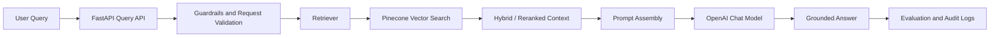
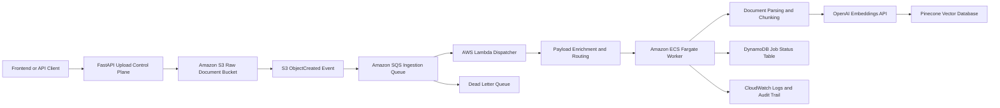

# Retrieval Process Docs

> Production-oriented RAG system with an event-driven document ingestion pipeline on AWS.

This project combines:

- a **RAG application** for grounded retrieval and answer generation
- a **queue-driven ingestion pipeline** for asynchronous document processing
- **AWS event-driven infrastructure** using S3, SQS, Lambda, Fargate, DynamoDB, Secrets Manager, and ECR
- **observability and evaluation** for production-minded GenAI engineering

## What This Project Is

At a high level, this repo demonstrates how to move from a simple RAG demo to a more production-shaped architecture:

- documents are uploaded and stored durably
- ingestion is decoupled from user-facing traffic
- processing is routed asynchronously
- heavier document work runs in containerized workers
- embeddings are generated and stored in Pinecone
- retrieval and generation are evaluated and observable

This is the current cloud ingestion path:

`S3 -> SQS -> Lambda -> Fargate -> OpenAI Embeddings -> Pinecone`

---

## RAG Architecture

The RAG side of the project follows this flow:

### RAG flow in plain English

1. A user submits a question.
2. The query is validated and optionally guarded.
3. Relevant chunks are retrieved from Pinecone.
4. Retrieval output is reranked or filtered into final context.
5. The answer is generated using retrieved evidence only.
6. The system captures logs, audits, and optional evaluation signals.

### Core RAG building blocks in this repo

- **Chunking**: recursive chunking with overlap
- **Embeddings**: OpenAI embeddings
- **Vector store**: Pinecone
- **Retrieval**: semantic retrieval with optional hybrid/rerank logic
- **Generation**: OpenAI chat model
- **Observability**: metrics, audit logs, tracing hooks
- **Evaluation**: Ragas-based offline evaluation

### Why this RAG design matters

This project is not just “LLM + prompt”.
It shows the full engineering shape around retrieval:

- document preprocessing
- vector indexing
- grounded context assembly
- evaluation separation between retrieval quality and generation quality
- production observability

---

## Queue-Based Ingestion Architecture

The ingestion pipeline is event-driven and designed to handle asynchronous document processing without blocking the application.

### Queue ingestion flow

1. A document is uploaded through the API flow or stored in S3.
2. S3 emits an `ObjectCreated` event.
3. SQS receives the event and acts as the ingestion buffer.
4. Lambda consumes the message and normalizes the payload.
5. Lambda dispatches a one-off Fargate task for heavier document ingestion.
6. The Fargate worker:
   - downloads the file
   - parses it
   - chunks it
   - generates embeddings
   - writes vectors to Pinecone
   - updates job status

### Why the queue matters

SQS is used to:

- absorb burst uploads
- decouple upload throughput from processing throughput
- support retries
- isolate failures through a DLQ
- protect the API from long-running document work

### Why Lambda and Fargate are both used

**Lambda**
- event-driven dispatcher
- lightweight orchestration
- no always-on poller to manage

**Fargate**
- runs heavier ingestion work
- better for larger dependencies and longer-running processing
- avoids EC2 management

### Job tracking

Cloud execution uses DynamoDB for shared ingestion state:

- queued
- processing
- completed
- failed

This makes the ingestion flow observable outside any single container or process.

---

## Does The Queue / Fargate Processor Handle OCR Or Text Ingestion?

### Text ingestion

Yes, the ingestion path handles **text-based document ingestion** now.

Current supported formats in the ingestion service include:

- `.pdf`
- `.txt`
- `.md`
- `.docx`
- `.html`
- `.csv`
- `.json` at the control-plane level

The worker parses supported documents, extracts text, chunks it, and pushes vectors into Pinecone.

### OCR

Not as a dedicated OCR pipeline yet.

Right now the project relies on document readers/parsers for text extraction, but it does **not yet include a specialized OCR stage** such as:

- Amazon Textract
- Tesseract
- image-to-text fallback pipeline

So the answer is:

- **text ingestion**: yes
- **full OCR pipeline for scanned/image-only documents**: not yet

### How OCR would fit later

The existing queue/Fargate design is a good base for OCR extension.
A future OCR path would likely be:

`S3 -> SQS -> Lambda -> Fargate or Textract -> Chunking -> Embeddings -> Pinecone`

---

## Security Design

This project uses production-oriented security patterns:

- raw API keys are stored in **AWS Secrets Manager**
- Lambda and ECS use **least-privilege IAM roles**
- document bytes stay in **S3**, not in queue messages
- Fargate runs in **private subnets**
- outbound connectivity is provided via **NAT**
- queue messages carry metadata, not file contents

---

## Observability

The system captures several operational signals:

- CloudWatch logs for Lambda and Fargate
- audit records written by the application
- retrieval and ingestion logs
- Prometheus / Grafana support for app-side observability

Example tracked signals:

- file parsed
- chunk count
- embedding requests
- vectors upserted
- ingestion completion
- query latency
- evaluation metrics

---

## Evaluation

This project includes offline evaluation for the RAG side using Ragas.

Current tracked themes include:

- faithfulness
- answer relevancy
- retrieval quality
- context usefulness

This helps separate:

- retrieval problems
- generation problems

instead of treating RAG as a black box.

---

## AWS Infrastructure Used

Provisioned components include:

- Amazon S3
- Amazon SQS
- SQS Dead Letter Queue
- AWS Lambda
- Amazon ECS Fargate
- Amazon DynamoDB
- AWS Secrets Manager
- Amazon ECR
- CloudWatch Logs
- NAT Gateway and private subnet routing

Terraform is used to provision the infrastructure.

---

## Why This Project Is Useful For Interviews

This repo demonstrates real GenAI engineering themes that commonly show up in interviews:

- full RAG architecture
- queue-based asynchronous ingestion
- Lambda vs Fargate tradeoffs
- event-driven cloud design
- retries and DLQ thinking
- secure secret management
- private subnet networking
- vector indexing pipeline design
- evaluation and observability

---

## Project Status

Currently validated:

- local ingestion pipeline
- cloud event flow from S3 to SQS to Lambda to Fargate
- Fargate-based document processing
- OpenAI embedding calls
- Pinecone vector upserts

Current ingestion architecture docs:

- [docs/document-ingestion-architecture.md](/Users/hamza/Desktop/PROJECTS/retrieval-process-docs/docs/document-ingestion-architecture.md)
- [docs/event-driven-ingestion.md](/Users/hamza/Desktop/PROJECTS/retrieval-process-docs/docs/event-driven-ingestion.md)

---

## Core Stack

- FastAPI
- OpenAI
- Pinecone
- LangChain
- LlamaIndex
- Ragas
- AWS S3
- AWS SQS
- AWS Lambda
- AWS ECS Fargate
- DynamoDB
- Secrets Manager
- Terraform
- Prometheus
- Grafana

---

## Short LinkedIn Summary

Built a production-style RAG system with an event-driven document ingestion pipeline on AWS using S3, SQS, Lambda, Fargate, DynamoDB, Secrets Manager, ECR, OpenAI, and Pinecone. The system ingests uploaded documents asynchronously, processes them in containerized workers, generates embeddings, and stores vectors in Pinecone while preserving secure secret management, private-subnet networking, and production-minded observability.
