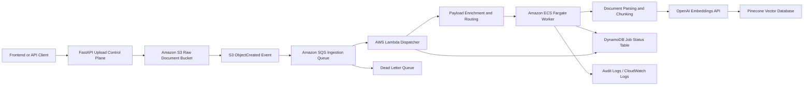

# Document Ingestion Pipeline Architecture

This document describes the event-driven document ingestion pipeline used in this project for scalable RAG ingestion on AWS.

It is designed to support:

- direct document upload to object storage
- asynchronous processing for bursty workloads
- Lambda-first event routing
- Fargate execution for heavier document processing
- durable job tracking
- secure secret handling
- vector indexing into Pinecone

## Architecture Diagram

## End-to-End Flow

1. A user or upstream system uploads a document through the application flow.
2. The control-plane API validates the request, creates a job record, and stores the raw file in S3.
3. S3 emits an `ObjectCreated` event.
4. The event is delivered to SQS to decouple upload throughput from processing throughput.
5. Lambda consumes the SQS message and normalizes the payload into the shape expected by downstream workers.
6. Lambda dispatches a one-off Fargate task for document processing.
7. The Fargate worker downloads the document, parses it, chunks it, generates embeddings, and upserts vectors into Pinecone.
8. The worker updates the job status and writes operational logs and audit records.

## Why This Design

### S3

S3 is the durable landing zone for uploaded documents.

- supports large file uploads
- decouples raw file storage from compute
- enables replay and auditability

### SQS

SQS absorbs spikes and protects the processing tier from burst traffic.

- retry support
- dead-letter queue support
- asynchronous decoupling

### Lambda

Lambda is used as the first event-driven router, not the heavy document processor.

- no long-running poller to manage
- reacts automatically to queue events
- lightweight transformation and orchestration layer

### Fargate

Fargate is used for real document processing work.

- better fit for heavier dependencies
- better fit for longer-running parsing and embedding tasks
- no EC2 management overhead

### DynamoDB

DynamoDB is the shared status store for cloud execution.

- job creation
- job progress
- completion and failure states

### Pinecone

Pinecone stores the final vectorized document chunks used by retrieval.

## Security Design

The pipeline uses several production-oriented security practices:

- raw secrets are stored in AWS Secrets Manager
- ECS task roles and Lambda roles use least-privilege IAM
- raw documents stay in private S3 buckets
- Fargate tasks run in private subnets
- outbound internet access is provided through NAT rather than public task IPs
- only metadata, not file bytes, is sent through SQS

## Operational Characteristics

### Scalability

- S3 handles raw file storage at scale
- SQS smooths traffic bursts
- Lambda scales horizontally for queue-triggered orchestration
- Fargate tasks can scale per document-processing workload

### Reliability

- SQS provides retry semantics
- failed messages can be isolated through a dead-letter queue
- raw files remain durable in S3
- logs and audit events support investigation and replay

### Observability

The ingestion flow is observable through:

- CloudWatch Logs for Lambda and Fargate
- audit log records written by the application
- job status records in DynamoDB

## Current Execution Model

At the current stage of the project:

- S3 uploads trigger SQS events
- Lambda normalizes and dispatches processing
- Fargate performs document ingestion and vector indexing

This means the current working cloud path is:

`S3 -> SQS -> Lambda -> Fargate -> OpenAI -> Pinecone`

## Interview Talking Points

This architecture is a strong example of:

- event-driven document ingestion
- AWS-native asynchronous processing
- Lambda for routing and orchestration
- Fargate for heavier AI workloads
- secure secret management and IAM
- production-minded RAG ingestion design

## LinkedIn Summary

Built a production-style event-driven document ingestion pipeline for RAG on AWS using S3, SQS, Lambda, Fargate, DynamoDB, Secrets Manager, and Pinecone. The system accepts raw document uploads, routes ingestion asynchronously, processes documents in containerized workers, generates embeddings, and writes vectors into Pinecone with secure secret handling and private-subnet networking.
